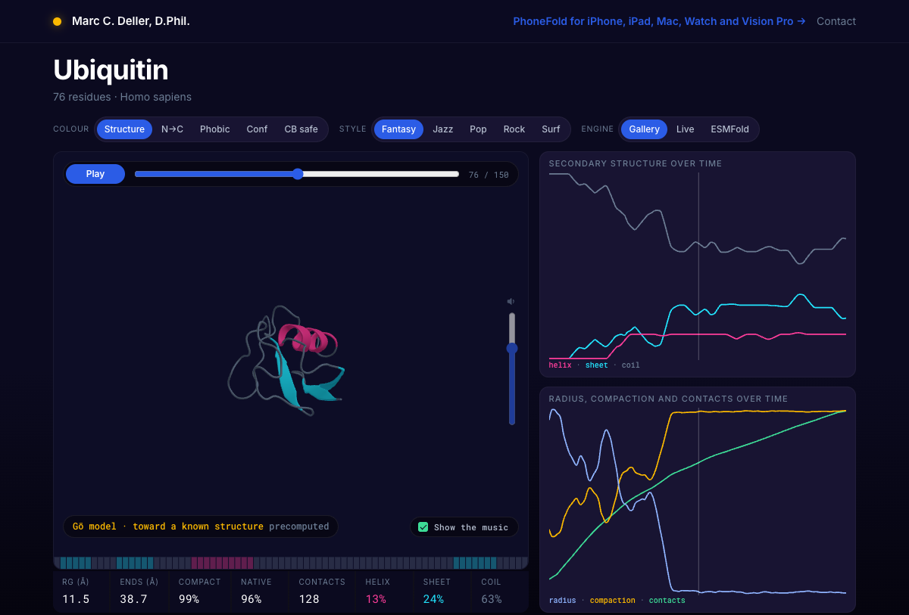

# 🧬 ButtFold

> **A protein folds in your browser and the trajectory becomes music.**

[](https://buttfold.mdeller.com)               

<table>
<tr>
<td>🌐 <b>App</b></td><td><a href="https://buttfold.mdeller.com" target="_blank" rel="noopener noreferrer">buttfold.mdeller.com</a></td>
<td>✉️ <b>Contact</b></td><td><a href="mailto:marc@marcdeller.com">marc@marcdeller.com</a></td>
<td>🐙 <b>GitHub</b></td><td><a href="https://github.com/bellcheddar/ButtFold" target="_blank" rel="noopener noreferrer">bellcheddar/ButtFold</a></td>
</tr>
</table>

---



ButtFold takes a named protein, starts it as a self-avoiding random coil, and folds it with a
C-alpha structure-based (Gō) model until it reaches its native structure. The trajectory is the
instrument: contacts forming are note onsets, sequence separation sets register, hydropathy sets
pitch, secondary structure sets texture (helix a sustained pad, sheet a staccato figure, coil an
arpeggio), and compaction drives an accelerando. It is the web version of
[PhoneFold](https://github.com/bellcheddar/PhoneFold), and it plays the same piece: `Sonifier.js`
is held to note-for-note agreement with the shipped Swift, 15,536 notes across two proteins and
all five styles, zero differences.

Why it matters: most things that show a protein "folding" are showing you a structure prediction
being refined, which is a picture of a computation rather than of a molecule, and the ones that
sonify proteins almost always sonify the **sequence**, which is a lookup table set to music. This
does neither. The physics is a real dynamical trajectory computed from scratch in your browser,
and every note in the piece is caused by something the chain actually did, which makes the music a
reading of the fold instead of a decoration on it. It is useful for: teaching what a folding funnel
sounds like, showing a coarse-grained simulation to people who will never open a terminal, and
hearing the difference between a protein that packs a hydrophobic core and one that never resolves.

**What it is not.** This is a funnelled coarse-grained simulation of a protein whose structure is
already known, in the tradition of Clementi, Nymeyer and Onuchic (*J. Mol. Biol.* **298**:937,
2000). It is not a structure prediction, it is not an unbiased physical force field, and no protein
folds this way. The app says so on the page, next to the thing it is describing, rather than in an
About box.

## 🧱 Three ways to get a trajectory, one player

Everything downstream of "a stream of CA frames" is shared. The three sources produce
byte-identical frame objects, which is tested rather than asserted.

| | What it is | Compute | When it runs |
|---|---|---|---|
| **Gallery** | Six Gō folds and three Genie 2 backbones, precomputed | none | Always. First paint, no capability check, no wait |
| **Fold it live** | The same C compiled to WebAssembly, in a Web Worker | your CPU | The primary interactive path where the browser can run it |
| **ESMFold** | ESMFold predicts a real UniProt protein at Meta; the same C, compiled natively, folds a chain toward that prediction here | ~1 s at Meta, then the droplet | Pick a protein nobody precomputed |
| **Genie 2** | A diffusion model invents a backbone from noise; the denoising *is* the trajectory | baked on a Mac, once | Always, in the gallery |

A fold the server computes is baked into the gallery's own artefact format, so a queued result
plays through the identical player with no code path of its own, and converges the cache: a
protein folded once is served from disk forever after.

**The ESMFold engine keeps two claims apart.** ESMFold predicts where a protein ends up; the
Gō model animates a chain collapsing toward that prediction. The second was never a physical
folding pathway and the first can be wrong, so the badge says `predicted at Meta, folded here`
rather than anything implying this server did the science. It runs at Meta because
`facebook/esmfold_v1` is an 8.44 GB checkpoint and the droplet has 3.9 GB with no swap —
not slow, impossible.

The 24 proteins on offer were **screened by predicting every candidate**, not by name. Ranking
UniProt's reviewed 40–76-residue entries by how well studied they are returns twenty-five
ribosomal proteins in the top twenty-five, and a ribosomal protein is only folded inside the
ribosome. Two measurements do the filtering — ESMFold's own mean pLDDT ≥ 0.70, and a radius of
gyration within 1.20× of the folded-globule scaling the sonifier already uses. That second bar
was moved from 1.35 by a fold that failed its bake gate, and the three entries it removed were
a dimer, an 11-mer and a dodecamer: proteins that *are* folded alone but are only compact as an
assembly, which is the ribosomal error one step subtler.

**Genie 2 runs the trajectory backwards, and almost none of that is cosmetic.** A Gō fold
starts as an extended coil and collapses; a diffusion trajectory starts with every residue
piled into a ball of radius 1.1 Å and *inflates* into a protein, growing secondary structure
on the way out. Measured on an 80-residue sample: Rg 1.1 → 11.2 Å, and 3003 of 3004 contacts
"form" on frame one because at the start everything is within any distance you care to name.

Both bake gates therefore fail, and they are right to — they are assertions about *folding*.
The generative bake states the mirror image of each (it must expand fourfold, start as noise,
end with CA–CA at 3.80 Å, and finish with real secondary structure), and it goes through the
same `build_frames` rather than a second builder, because one frame builder is what makes the
Python-vs-JavaScript parity test possible at all. The contact rule is two-sided for it: not
"are these residues close" — they always are — but "are they at their final separation",
which measured 0.00 → 1.00 across a trajectory where the one-sided rule read 1.00 throughout.
Its tempo comes from that same number, because `compaction` clamps to 1 on the first frame
and would otherwise play the whole piece flat out. And it is baked rather than served live
because 1000 denoising steps is 2.2 minutes on a Mac and 10.2 on the droplet, with no
speed-up from more cores.

**The music is drawn on the structure.** A contact note is an event between two residues —
the score stores both — and both are already on the stage, so when the note sounds a line is
struck between them: green for a contact, amber for a core contact in the bass voice, fading
at the note's own velocity. Its two residues brighten on the ribbon at the same moment. Under
it, the chain unrolled into a strip, one cell per residue in the cartoon's own colours,
lighting from **all five voices** — the pad picks helix residues, the rhythm picks sheet ones,
so the strip carries the whole texture rather than the contacts alone. At rest that strip is a
sequence view of the secondary structure, re-forming as the fold does.

Both read the same list, and they get it by **asking the audio clock what is sounding** rather
than being told by the scheduler. The scheduler queues a second ahead, so a visual driven from
it would run ahead of its own music, and it queues nothing while paused, so scrubbing would
show an empty stage. A query cannot drift, because it *is* the clock the animation already
follows. A note is drawn for the longer of its own length and a 0.9 s floor: a contact is a
semiquaver and would otherwise be a single frame, and a pad chord is held for a whole bar and
would otherwise go dark while you could still hear it.

**Both computed paths are watched as they happen**, which for the server means the browser reads
the coordinate file the droplet is still writing to. Progress there was a percentage over a still
picture: the droplet folded for half a minute while a number climbed, and the same protein folding
in the browser beside it turned and collapsed the whole time. The frames were already on disk, so
the route serves what is there and the browser runs the same `frames.js` over it that the live
worker runs on its own output. The secondary-structure and radius-of-gyration charts are drawn a
frame at a time from either source.

## 🎹 How a trajectory becomes music

The mapping is PhoneFold's, row for row, because the point is that someone who plays with this and
then downloads the app hears the same piece.

| Trajectory feature | Musical parameter |
|---|---|
| New contact event | Note onset; sequence separation sets the register |
| Long-range hydrophobic contact | Bass note (core packing) |
| Helix content | Sustained pad, stacked fourths |
| Sheet content | Staccato interlocking figure |
| Coil content | Arpeggiation between chord tones |
| Per-residue confidence | Note velocity for that residue |
| Mean confidence | Low-pass cutoff, detune, reverb |
| Radius of gyration | Tempo and register |
| Convergence | Cadence, resolving to the tonic |

"Confidence" here is the fraction of a residue's own native contacts that have formed, which is
real per-residue information: the hydrophobic core locks in first and completely while the termini
are still loose, so a region that never resolves stays a detuned wash for the whole piece.

Five styles ship (Fantasy, Jazz, Pop, Rock, Surf) and are the app's own JSON files, byte-identical.
Each note is placed in space at its residue's live 3D position through a `PannerNode` with HRTF, so
the fold collapses around the listener.

## 🚀 Usage

Open <https://buttfold.mdeller.com>. Press Play. Drag the structure to turn it, scroll to zoom,
double-click to reframe.

To run it locally:

```bash
git clone https://github.com/bellcheddar/ButtFold.git
cd ButtFold
python3 -m venv .venv
./.venv/bin/pip install -r requirements-dev.txt
./.venv/bin/python app.py                    # http://127.0.0.1:8007/
./.venv/bin/python -m buttfold.worker        # optional: the fold queue
```

`requirements.txt` is the web layer (Flask and gunicorn, no numpy) and `requirements-queue.txt` is
the worker (numpy, for the bake). They are deliberately disjoint: the droplet runs both processes
under separate systemd budgets so a fold can never starve the six other apps on the box.

## 🔧 Rebuilding the artefacts

Everything the app serves is committed. These regenerate it, and all of them run on the Mac.

| Command | What it does |
|---|---|
| `tools/extract_natives.py` | Vendors the native structures and starting coils from PhoneFold into `data/natives/` |
| `tools/bake_gallery.py` | Folds the six gallery proteins and bakes them, with the collapse assertions |
| `tools/bake_gallery.py --frame-fixtures` | Also writes the exact coordinates the JS parity test compares against |
| `tools/build_wasm.sh` | Compiles the Gō model to WebAssembly, emsdk pinned at 4.0.7 |
| `tools/swift_score_dump/run.sh` | Runs PhoneFold's own Sonifier over this gallery to produce the reference scores |
| `tools/psea.py --fixtures`, `tools/contacts.py --fixtures` | Reference outputs for the JS geometry ports |
| `tools/check_all.sh` | Every machine-verifiable gate in one command |

## 🧪 Testing: verify the artefact, not the intent

`tools/check_all.sh` runs seven gates. Four of them drive a real browser, because the failures that
matter here are the ones where every unit test passes and the page does nothing.

| Gate | What it proves |
|---|---|
| `audit_wiring.py` | Every route, module, style, card and element id is reachable. Anything declared and never reached fails the build |
| pytest, 87 tests | Routes, caching, the queue's caps and cache, the honesty strings, and the committed artefact's own assertions |
| `node --test`, 62 tests | The WASM module against the CLI, the JS geometry ports against the Python, the sonifier against the Swift, the camera's interaction model, and the frame the browser keeps mid-fold against the one the baker keeps |
| stage renders | A headless screenshot of the stage mid-fold is non-uniform, the three colour modes render differently, and the Play bar is above the fold at four common screen sizes |
| drag, zoom, reframe | Real pointer input through the DevTools protocol reaches the camera |
| sound | The score reaches a **running** `AudioContext` from a real click, the animation follows the audio clock, and the notes sounding mid-playback are drawn as chords on the structure and lit cells on the ribbon |
| live fold, and the queue | A browser folds trp-cage to Q >= 0.95, and the droplet returns a fold and then serves it from cache. Both must be seen mid-fold: at least three distinct frame counts while the status still reads "folding", with the charts carrying a point per frame |

The animation between frames is a morph and the page says so. The 150 poses in a trajectory
are 50,000 integration steps apart - far enough that an alpha carbon moves up to 30 Å between
two of them - so a straight interpolation tears the chain (the worst CA-CA bond came out 97%
short) and is followed by a bond projection that puts it back. Nothing drawn between two
frames is a state the model passed through, which is in the disclosure paragraph rather than
left implied.

Two assertions run at bake time and are repeated against the committed file, because they are the
ones that catch a trajectory which is not doing the thing the animation is about: the chain must
collapse (`Rg_end / Rg_start <= 0.8`) and it must not start folded (under 25% of contacts on the
first frame). PhoneFold threw away a whole bake for want of them.

## 📊 Measured, not estimated

Full detail with machines and dates in [`METRICS.md`](METRICS.md). Nothing is quoted anywhere in
this project until it is a measured row there.

| | |
|---|---|
| trp-cage, folded live in Chrome | 11.2 s, final Q 1.000, 152 frames streamed |
| the same fold, module alone, no frame building | 7.4 s (1.4x the native binary) |
| trp-cage, folded on the droplet | 25.7 s under its CPU quota (16.6 s unconstrained) |
| ubiquitin, on the droplet | 7 min 07 s, which sets the 76-residue cap |
| WASM against native, forces | agree to 2.9e-15 relative, against a 1e-9 bar |
| Sonifier.js against the shipped Swift | 15,536 notes, **0 differences** |
| Live path against baked path | 300 frames, 5 fields each, **byte-identical** |
| Baked gallery payload | 842 kB for six folds and 900 frames |

One number that changed a plan: the parity bar was written as "RMSD within 0.1 Å of the native
build". Measured, the **same** build folding the **same** coil lands anywhere from 0.84 to 1.16 Å
depending only on the random-force seed, so that bar is narrower than the measurement's own noise
and no correct implementation can meet it. Q over the same five seeds was 0.993 every time, so Q
carries the weight and the RMSD bar is taken from the measured spread.

## ✅ To Do

Roadmap for ButtFold, roughly in dependency order. Suggestions welcome.

- [x] **Measure before building.** Droplet fold times, WASM speed in three browsers, WASM parity
      against native, and the baked payload size, all in `METRICS.md` before a line of the app
      existed. Two of the plan's own numbers had to change as a result
- [x] **The baked gallery.** Six Gō folds with the collapse and first-frame-contact assertions
      green, served by Flask with explicit Cache-Control because Flask sends none on a template
      and heuristic caching then makes a deploy invisible
- [x] **The 3D stage.** three.js tube along the CA trace, coloured by secondary structure, with
      live readouts and two time series. A degenerate initial spline gave the tube a NaN bounding
      sphere and three.js frustum-culled it forever behind a page that otherwise looked perfect
- [x] **Note-for-note sonifier parity with the shipped app.** Float32 is emulated with
      `Math.fround` wherever the Swift uses `Float`: mean confidence accumulates over 76 residues
      in single precision on the phone, and the difference reaches note velocity and the cadence
- [x] **The Web Audio engine.** All five style profiles unchanged, per-note HRTF panning, a
      lookahead scheduler, and the audio clock driving the animation rather than the reverse
- [x] **The live WebAssembly fold.** `wasm_api.c` is additive: it `#include`s the vendored C
      rather than editing it, and reproduces the CLI's trajectory bitwise
- [x] **The droplet queue.** One worker at nice 19 behind a residue cap, a depth cap, a per-IP cap
      and a timeout of three times the measured worst case, with a cache that converges
- [x] **The honesty layer.** The app's own disclosure strings byte for byte, an engine badge that
      never scrolls away, and a disclosure paragraph as body text rather than behind a link
- [x] **PhoneFold's camera.** Ported after drag-to-rotate proved broken the same way the app's
      once was: yaw and pitch with a clamp, which makes a vertical drag die mid-gesture. A
      quaternion attitude on the subject has no pole to protect
- [ ] **Cartoon secondary structure.** The ribbon is a plain tube, so a helix reads as a coiled
      tube and a strand as a straight one. The app draws a flat helical ribbon and an arrowed
      strand, and this is the biggest remaining visual gap
- [ ] **Genie 2 gallery entries.** Two to four backbones precomputed on the Mac, carrying the
      generative disclosure on both the card and the stage. Genie 2 needs Core ML or a GPU, so
      these can only ever be baked, never folded live
- [ ] **Mobile Safari's fold time.** The one measurement no machine here can take, and the one
      that decides whether phones fold live at all or route to the queue
- [ ] **The PhoneFold store link.** `static/links.json` carries a null `app_store_url`, so the
      card honestly says "in review". One field flips it when the app clears review

## 📚 Provenance and licences

The Gō model, the five style profiles, the native structures and the geometry and audio ports all
come from [PhoneFold](https://github.com/bellcheddar/PhoneFold) (MIT), vendored with provenance
headers naming the source commit and re-vendored rather than patched. The C is unedited.
[`THIRD-PARTY.md`](THIRD-PARTY.md) lists everything, with the papers behind the model, the
secondary-structure assignment, the hydropathy scale and both radius-of-gyration scaling laws.

ButtFold's own code is MIT: see [`LICENSE`](LICENSE).

The name is a joke about an accidental butt-dial. The page says so once, in the footer, and never
again.

---

## 👤 Author

**Marc C. Deller, D.Phil.**  
Structural biologist & drug discovery scientist  

<table>
<tr>
<td>🌐</td><td><a href="https://marcdeller.com" target="_blank" rel="noopener noreferrer">marcdeller.com</a></td>
<td>✉️</td><td><a href="mailto:marc@marcdeller.com">marc@marcdeller.com</a></td>
<td>🐙</td><td><a href="https://github.com/bellcheddar/ButtFold" target="_blank" rel="noopener noreferrer">github.com/bellcheddar/ButtFold</a></td>
</tr>
</table>
